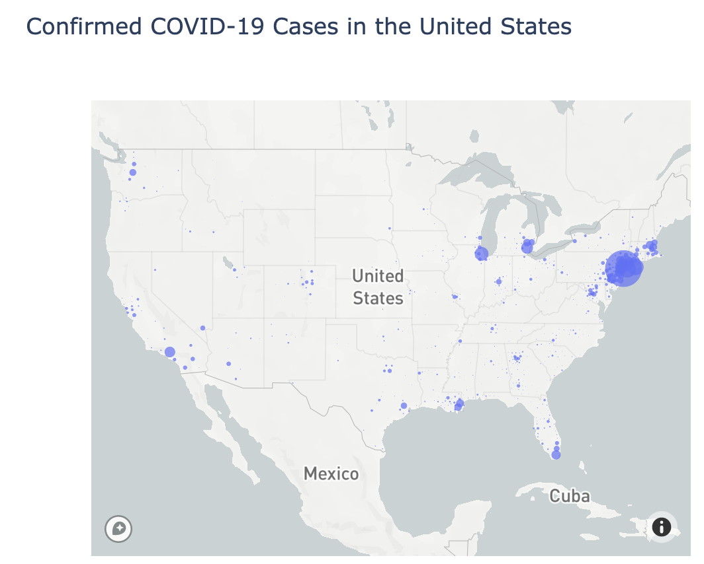

# 0426-Tracking_Covid19_Sanny-YE

# Tracking Critical Covid-19 Data
## Background 
In this project, we will create an animated data visualization that demonstrates the number of cumulated COVID-19 confirmed cases in US counties, which can help us better understand how the virus is spreading within the United States and which county and state governments, businesses, and other organizations might need support during the pandemic.

### Business Question
How can we visualize and better understand the overall toll of the COVID-19 pandemic on US counties or county equivalents?

### Data Question 
Which data and metrics can we use to answer our question? 

## Data Analysis
First, we used mapbox to make a bubble map of cumulative confirmed COVID-19 cases in US counties, where the radius of the bubble corresponds to the number of cumulative confirmed COVID-19 cases in US counties as of April 14, 2020.

We then used plotly express to build an animated choropleth map that shows the number of cumulative confirmed COVID-19 cases per 1,000 residents in US counties on April 14, 2020.

Next, we built a choropleth map to showcase trends and regional differences in the density of cumulated confirmed COVID-19 cases in each US county since January 2020. 

## Conclusion
How might our data visualizations help county and state leadership or business owners in the US? What other data might we want to incorporate into an animated choropleth map to better understand the toll of the novel coronavirus in the United States?

## Additional Links
1) Data Source: https://github.com/CSSEGISandData/COVID-19/tree/master/csse_covid_19_data/csse_covid_19_daily_reports
2) Tutorial: https://melanieshimano.gitbook.io/covid-19-critical-trend-data-visualizations/
